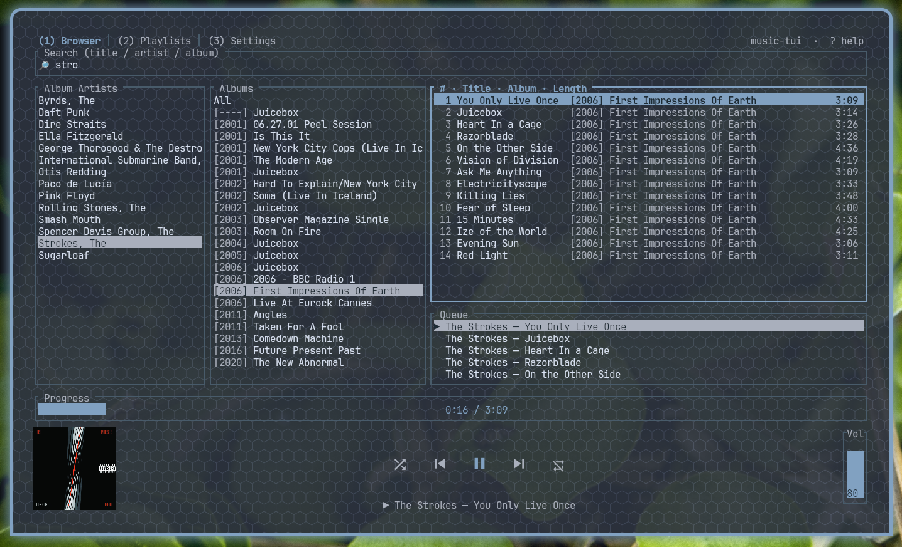

# music-tui



A keyboard- and mouse-driven terminal music player built with [ratatui](https://ratatui.rs).
It scans a local music library, browses it by album artist / album / track, manages a
play queue and playlists, and plays audio with optional gapless crossfade. In
[kitty](https://sw.kovidgoyal.net/kitty/) it also renders album art and oversized
transport icons.

## Features

- Three-column browser: album artists → albums (by year) → tracks, with a live search bar
- Play queue and saved playlists
- Gapless playback with a configurable crossfade
- Clickable, draggable progress and volume bars
- Album art (kitty graphics protocol) with an on-disk thumbnail cache
- Mouse support throughout; resizable panes (keyboard and drag)
- Configurable color theme

## Requirements

- Rust (2024 edition; tested on 1.92)
- An audio output device (ALSA on Linux)
- A [Nerd Font](https://www.nerdfonts.com/) for the transport icons
- **kitty ≥ 0.40** for album art and 2× transport icons (other terminals run fine; those
  two features degrade gracefully)

## Build & run

```sh
cargo run --release
```

On first launch, open the **Settings** tab (`3`), set your music directory (`e`, defaults
to `~/Music`), and scan it (`r`). The browser populates once the scan completes.

## Supported formats

MP3, FLAC, WAV, AIFF, Ogg Vorbis, and MP4/AAC/ALAC are decoded via
[Symphonia](https://github.com/pdeljanov/Symphonia). Opus support depends on Symphonia and
may be incomplete. Tags and cover art are read with [lofty](https://github.com/Serial-ATA/lofty).

## Keyboard shortcuts

Press `?` in the app for the full list. Highlights:

| Key | Action |
| --- | --- |
| `1` / `2` / `3` | Browser / Playlists / Settings tab |
| `/` | focus search; `Esc` clears it |
| `Tab` / `Shift-Tab` | cycle focus (columns, bars, buttons) |
| `↑↓` or `k`/`j` | move selection |
| `←→` or `h`/`l` | change column |
| `Enter` | open artist/album · play track |
| `a` | add to queue (in the queue, removes the item) |
| `c` | clear queue |
| `Space` | play / pause |
| `n` / `p` | next / previous |
| `s` / `r` | shuffle / repeat (off → all → one) |
| `+` / `-` | volume |
| `[` / `]` | seek −/+ 5s |
| `Alt+]` / `Alt+[` | grow / shrink the focused column (or the queue when it's focused) |
| `q` / `Ctrl-C` | quit |

In the **Playlists** tab: `n` save the current queue as a new playlist, `a` append the
queue to the selected playlist, `d` delete a playlist, `x` remove a track, `Enter` play.

Mouse: click rows, tabs, and transport buttons; drag the progress/volume bars and the
pane dividers.

## Configuration

Settings live in `config.toml` (path shown in the Settings tab). Edits are applied on
restart; comments you add are preserved. Example:

```toml
music_dir = "/home/you/Music"

[theme]
accent = "cyan"         # names ("cyan"), hex ("#ff8800"), or 256-color index ("39")
selection_fg = "black"
border = "darkgray"
dim = "darkgray"
muted = "gray"

[layout]
columns = [25, 30, 45]  # browser column widths (%), kept in sync with on-screen resizing
queue_pct = 28          # queue height (%) within the third column

[playback]
gapless_fade_secs = 3.0 # crossfade seconds between tracks (0 = hard cut)

[ui]
big_transport_icons = true  # 2x icons via the kitty text-sizing protocol
cache_all_art = false       # pre-cache all cover thumbnails in the background
sort_articles = true        # display/sort "The Doors" as "Doors, The"
```

## Files and directories

The application follows the platform's standard directories (paths below are Linux/XDG;
macOS and Windows use their respective conventions via the
[`directories`](https://crates.io/crates/directories) crate).

| Path | Purpose |
| --- | --- |
| `~/.config/music-tui/config.toml` | user configuration (created on first run) |
| `~/.local/share/music-tui/library.db` | SQLite index of the scanned library |
| `~/.local/share/music-tui/playlists.toml` | saved playlists |
| `~/.cache/music-tui/art/` | cached cover-art thumbnails (PNG) |

Your music files are only ever read, never modified. Deleting any of the files above is
safe: the library re-scans, playlists reset, and thumbnails regenerate on demand.

## License

Released under the [MIT License](LICENSE).
